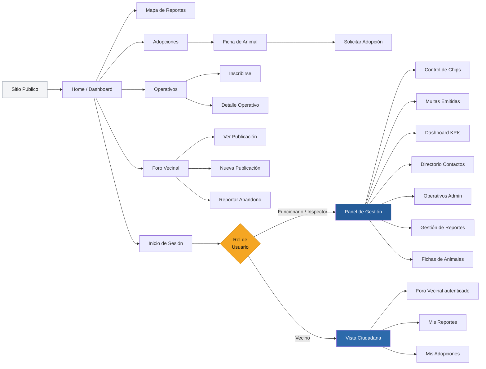
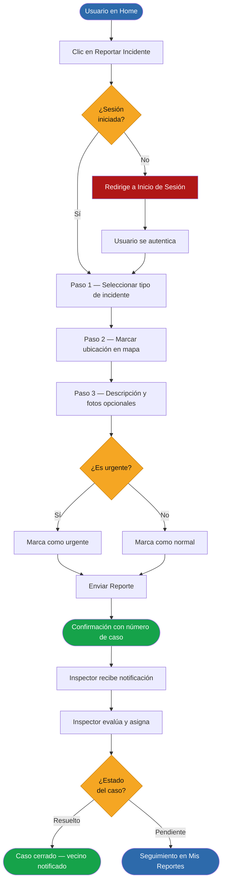

# App Bienestar Animal - Municipalidad de Santo Domingo

Esta aplicación es una plataforma desarrollada para la Municipalidad de Santo Domingo que busca fomentar la tenencia responsable de mascotas, permitiendo a los usuarios reportar incidentes, gestionar adopciones y visualizar un mapa de calor comunal en tiempo real.

**Prototipo interactivo en Figma:** [Ver Mockup Web](https://www.figma.com/site/3oyQIa6mumsEFA5U5rl4V9/Mockup-WEB?node-id=0-1&p=f&t=PePYONOImoEJhd8l-0) *(acceso público)*  
**Arquitectura UX en Figma:** [Ver Diagrama Completo](https://www.figma.com/board/cgeHwEwXP67bQdPYxucQKI/Arquitectura-UX---Bienestar-Animal?node-id=0-1&p=f&t=DJdrskBNUpx3DqUi-0) *(acceso público)*

---

## Requisitos e Instalación (Solución a Conflicto de Dependencias)

> ⚠️ **NOTA CRÍTICA DE INSTALACIÓN:** Debido a que el entorno utiliza configuraciones de vanguardia basadas en **Vite 8.0**, y ciertos plugins internos de Ionic y Vitest mantienen dependencias de revisión previas, el gestor de paquetes de Node (`npm`) podría interrumpir la instalación por conflictos de pares (`ERRESOLVE`). 
>
> Para asegurar una compilación limpia y exitosa sin alterar el árbol lógico del proyecto, **es estrictamente obligatorio ejecutar la instalación utilizando la bandera de compatibilidad heredada**.


## Tecnologías Utilizadas

| Capa | Tecnología |
|------|-----------|
| Framework UI | Ionic Framework + React 18 |
| Lenguaje | TypeScript |
| Build Tool | Vite |
| Estilos | Tailwind CSS v4 |
| Enrutamiento | React Router DOM |
| Testing E2E | Cypress |

## Requisitos e Instalación

Para ejecutar este proyecto localmente, necesitas tener instalado Node.js y el CLI de Ionic.

1. Clonar el repositorio:
   ```bash
   git clone [https://github.com/Dakotahh1/Pagina-Web-Municipalidad-Santo-Domingo.git](https://github.com/Dakotahh1/Pagina-Web-Municipalidad-Santo-Domingo.git)

2. Desplazarse a la raiz del proyecto cd Pagina-Web-Municipalidad-Santo-Domingo
3. Instalar dependencia omitiendo el bloqueo de pares (Resolucion del error del entorno) : `npm install --legacy-peer-deps`
4. Levantar el servidor de desarrollo: `ionic serve`

---

## EP 1.2: Justificación del Problema y Usuario Objetivo

### Contexto y Necesidad Comunal

La comuna de Santo Domingo presenta una marcada dualidad geográfico-social, dividida en extensas áreas rurales y zonas urbanas densas. Esta distribución dificulta el control de la tenencia responsable de mascotas, traduciéndose en una constante proliferación de animales callejeros y denuncias por ataques a fauna nativa o ganadería menor.

Actualmente, el municipio gestiona estos problemas de manera informal (registros en papel y reportes aislados en WhatsApp), lo que causa:

1. Pérdida de la trazabilidad en brotes de enfermedades zoonóticas.

2. Imposibilidad de generar estadísticas consolidadas para justificar la inyección de presupuestos estatales.

3. Respuestas tardías ante emergencias ciudadanas debido a la falta de centralización de la información.

---

## EP 1.1: Requerimientos del Sistema

### Roles Definidos

- **Vecino:** Ciudadano de la comuna que consume información, genera reportes y solicita adopciones.
- **Funcionario / Inspector:** Personal municipal que gestiona casos, administra fichas, registra operativos y consulta estadísticas.

### Requerimientos Funcionales

| ID | Módulo | Descripción por rol | Métrica Cuantitativa de Evaluación |
|----|--------|---------------------|------------------------------------------- |
| **RF-01** | Foro de Reportes | El Vecino puede publicar incidentes adjuntando texto, coordenadas geográficas y fotos. El Funcionario puede cambiar el estado a "Resuelto".| Tiempo de persistencia en renderizado menor a 1.5s. Admisión de strings de texto de hasta 1000 caracteres  |
| **RF-02** | Gestión de Adopciones | El Vecino visualiza animales y presiona "Solicitar". El Funcionario recibe la solicitud en una lista de espera indexada.| El sistema debe soportar un mínimo de 200 solicitudes simultáneas sin pérdida de paquetes de datos. |
| **RF-03** | Ficha Clínica Digital | El Funcionario puede crear, actualizar y archivar el historial médico de un animal (vacunas, esterilizaciones).| El formulario debe validar campos obligatorios y rechazar inputs nulos con alertas nativas en < 200ms. |
| **RF-04** | Gestión de Operativos | El Funcionario agenda operativos territoriales. El Vecino se inscribe reduciendo los cupos disponibles en tiempo real. | Decremento atómico del contador de cupos. Bloqueo automático del botón de inscripción al llegar a 0 cupos. |
| **RF-05** | Control de Microchips | El Inspector asocia un código de microchip único al RUT de un vecino mediante un formulario indexado. | Validación de expresión regular: El código de chip debe poseer exactamente 15 dígitos numéricos estándar. |
| **RF-06** | Directorio de Contactos | Ambos Roles pueden consultar teléfonos, correos y horarios de la unidad de protección animal. | Buscador reactivo indexado por caracteres que filtra los datos en pantalla en un tiempo máximo de 100ms. |
| **RF-07** | Dashboard Estadístico | El Funcionario visualiza gráficos dinámicos con los KPIs mensuales del estado de la tenencia comunal.| Precisión del 100% en el cálculo de métricas en base a las filas de la consulta relacional SQL ejecutada. |

### Requerimientos No Funcionales (Medibles)

**RNF-01 (Usabilidad / Accesibilidad):** La interfaz debe garantizar una tasa de contraste mínima de 4.5:1 para textos normales conforme a las pautas WCAG 2.1 AA, utilizando botones interactivos expansivos (mínimo 48px de área táctil) para facilitar el uso a adultos mayores en Santo Domingo.

**RNF-02 (Rendimiento en Entornos Rurales):** El tamaño de carga de la landing page principal no debe exceder los 2.5 MB. Las imágenes de incidentes deben ser comprimidas en el cliente a un máximo de 2MB antes de viajar por la red, permitiendo un funcionamiento fluido en zonas con conectividad 3G/4G inestable.

**RNF-03 (Seguridad / Control de Acceso):** Todas las solicitudes a rutas administrativas (/admin/*) deben estar validadas mediante un middleware interceptor de tokens JWT. Cualquier petición sin credenciales o con un rol no autorizado debe ser rechazada y redirigida al /login en menos de 50ms.

---

## EP 1.3: Bocetos UI/UX y Mockups

A continuación se presentan los wireframes de media fidelidad desarrollados. Para cumplir la directriz de diseño centrado en el usuario, se han destacado los componentes interactivos (sidebars y menús) mediante bordes definidos y botones contrastados, asegurando que el evaluador distinga claramente los elementos clicables de los estructurales.

**Pagina de inicio**


**Panel administrativo**


**Ficha Animal**


---

## EP 1.4: Arquitectura de Navegación y UX

### Diagrama General de Arquitectura UX

<!-- INSTRUCCIÓN: subir Arquitectura_UX_-_Bienestar_Animal.png a un Issue de GitHub,
     copiar el link generado y reemplazar la línea de abajo -->
>  Ver diagrama completo en Figma: [Arquitectura UX — Bienestar Animal](https://www.figma.com/board/cgeHwEwXP67bQdPYxucQKI/Arquitectura-UX---Bienestar-Animal?node-id=0-1&p=f&t=DJdrskBNUpx3DqUi-0)

### Rutas del Sistema

| Zona | Rutas Disponibles |
|------|------------------|
| **Pública** (sin sesión) | `/login` · `/registro` |
| **Ciudadana** (Vecino autenticado) | `/app/inicio` · `/app/adopciones` · `/app/adopciones/:id` · `/app/foro` · `/app/operativos` · `/app/reportar` · `/app/mapa` |
| **Administrativa** (Funcionario) | `/admin/dashboard` · `/admin/reportes` · `/admin/fichas` · `/admin/chips` · `/admin/multas` |

### Mapa de Navegación y Jerarquía de Vistas

La vista **Inicio** funciona como concentrador principal (Nivel 1). Las vistas funcionales como Adopciones o Foro corresponden al **Nivel 2**. Las vistas de detalle como la Ficha de un animal son de **Nivel 3** y siempre exigen retorno directo a su vista padre.



### Permisos por Rol

| Acción | Público | Vecino | Funcionario | Inspector |
|--------|:-------:|:------:|:-----------:|:---------:|
| Ver adopciones | ✅ | ✅ | ✅ | ✅ |
| Ver Home / Dashboard | ✅ | ✅ | ✅ | ✅ |
| Ver mapa de reportes | ✅ | ✅ | ✅ | ✅ |
| Ver operativos | ✅ | ✅ | ✅ | ✅ |
| Leer foro | ✅ | ✅ | ✅ | ✅ |
| Solicitar adopción | ❌ | ✅ | ✅ | ✅ |
| Reportar incidente | ❌ | ✅ | ✅ | ✅ |
| Mis reportes y seguimiento | ❌ | ✅ | ✅ | ✅ |
| Publicar en foro | ❌ | ✅ | ✅ | ✅ |
| Dar animal en adopción | ❌ | ✅ | ✅ | ✅ |
| Dashboard con KPIs | ❌ | ❌ | ✅ | ✅ |
| Crear y editar fichas | ❌ | ❌ | ✅ | ✅ |
| Gestionar reportes | ❌ | ❌ | ✅ | ✅ |
| Directorio de contactos | ❌ | ❌ | ✅ | ✅ |
| Registrar operativos | ❌ | ❌ | ✅ | ✅ |
| Publicaciones oficiales | ❌ | ❌ | ✅ | ✅ |
| Fotografías y evidencia | ❌ | ❌ | ❌ | ✅ |
| Registrar chips | ❌ | ❌ | ❌ | ✅ |
| Emitir multas | ❌ | ❌ | ❌ | ✅ |
| Delegar y asignar casos | ❌ | ❌ | ❌ | ✅ |

### Flujo de Tarea Principal — Reportar un Incidente

El reporte ciudadano es el flujo más crítico del sistema. Está diseñado como un asistente paso a paso para reducir la fricción, especialmente cuando el usuario enfrenta una situación urgente.




### Decisiones de Diseño Justificadas

**Navegación Fija mediante Sidebar en Computadores:** Para el rol Funcionario se optó por un menú lateral izquierdo permanente. Esto aprovecha el ancho panorámico de los monitores de oficina de la municipalidad, manteniendo visibles los accesos directos y reduciendo el número de clics necesarios para alternar entre la gestión de fichas clínicas y la emisión de multas.
- **Separación visual total entre zona ciudadana y panel administrativo:** Los funcionarios requieren flujos de trabajo distintos (tablas, KPIs, formularios técnicos) que no son apropiados para el vecino.
- **Diseño responsivo diferenciado:** En escritorio (Funcionario) se emplea un Sidebar para aprovechar el ancho de pantalla. En móvil (Vecino) la navegación usa Bottom Tabs para acceso con una sola mano.
- **Framework Arquitectónico (Ionic + React):** La selección técnica responde directamente a la necesidad de construir una Single Page Application (SPA) altamente escalable. Al compilar sobre componentes nativos web optimizados, eliminamos la necesidad de descargas pesadas desde tiendas de aplicaciones, permitiendo a los ciudadanos rurales acceder instantáneamente escaneando códigos QR distribuidos en las juntas de vecinos de la comuna.

---

## EP 1.5 y EP 1.6: Arquitectura de Código e Integración del Enrutador

La aplicación implementa una arquitectura modular estricta y desacoplada bajo TypeScript, separando las responsabilidades de las vistas, los componentes de diseño atómicos, la lógica de estados globales y la comunicación asíncrona con el backend.

### Estructura y Árbol de Directorios del Proyecto
A continuación, se documenta la disposición real del código fuente dentro del directorio `src/`, reflejando una organización limpia alineada con las mejores prácticas de desarrollo en React e Ionic Framework:

```text
src/
├── assets/              # Recursos estáticos (Logotipos comunales, íconos y multimedia)
├── components/          # Componentes visuales reutilizables u organizadores
│   ├── AuthFooter.tsx   # Pie de página unificado para los formularios de credenciales
│   ├── AuthLayout.tsx   # Contenedor estructural semántico de autenticación
│   ├── FormField.tsx    # Abstracción de campos de texto con validaciones integradas
│   ├── PasswordInput.tsx# Input dinámico optimizado para contraseñas con máscara oculta
│   └── SupportNote.tsx  # Notas y advertencias de accesibilidad al pie de los flujos
├── context/             # Manejo del estado global de la aplicación
│   └── AuthContext.tsx  # Proveedor de sesión (Persistencia de tokens JWT y roles)
├── hooks/               # Custom hooks reutilizables para modularizar lógica
├── pages/               # Vistas completas de la plataforma segregadas por nivel de acceso
│   ├── private/         # Módulos privados restringidos bajo Guardas de Seguridad
│   │   ├── InspectorDashboard.tsx # Panel administrativo para Funcionarios/Inspectores
│   │   └── MainTabs.tsx # Navegación móvil mediante pestañas para el rol Vecino
│   └── public/          # Módulos de acceso ciudadano libre
│       ├── Login.tsx    # Formulario de inicio de sesión comunal
│       └── Registro.tsx # Formulario de inscripción y validación de datos del Vecino
├── routes/              # Capa de control de flujos perimetrales
│   └── ProtectedRoute.tsx # Componente interceptor para la validación de roles en sesión
├── services/            # Servicios asíncronos de conexión con la API REST
│   └── authService.ts   # Control de peticiones HTTP (Fetch/Axios) para login y registro
├── theme/               # Estilos globales y paleta de colores del Framework
│   └── variables.css    # Definición de variables CSS institucionales de Santo Domingo
├── utils/               # Funciones utilitarias secundarias y formateadores
├── App.tsx              # Orquestador del enrutamiento de la Single Page Application (SPA)
├── index.css            # Hoja de estilos globales inyectada por Tailwind / CSS nativo
├── main.tsx             # Punto de entrada lógico del compilador e hilo de ejecución en el DOM
└── vite-env.d.ts        # Definiciones de tipos globales del entorno de Vite
```
---

## Equipo de Desarrollo

| Nombre | Rol |
|--------|-----|
| Vicente Palma | Desarrollador Frontend, Documentación |
| Diego Alvarado | Aquitectura y Diseño UI/UX, Desarrollador Frontend |
| Ignacia Brahim | Documentación, Aquitectura y Diseño UI/UX  |

---

*Documento elaborado a partir de entrevista con el Jefe de Informática de la Municipalidad de Santo Domingo.*  
*Curso ICI4247-2 — Pontificia Universidad Católica de Valparaíso, 2026.*
