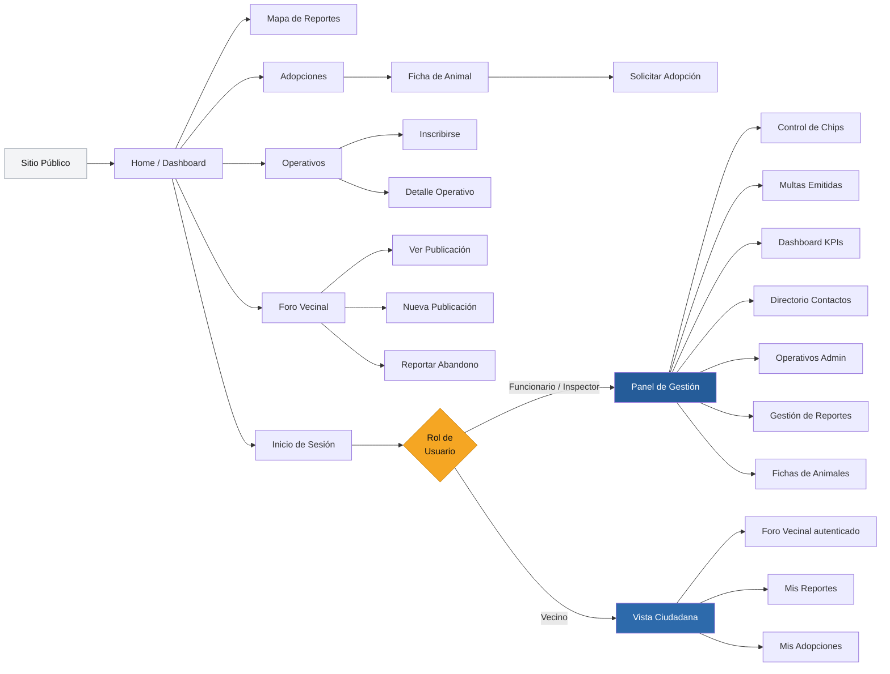

# App Bienestar Animal - Municipalidad de Santo Domingo

Esta aplicación es una plataforma desarrollada para la Municipalidad de Santo Domingo que busca fomentar la tenencia responsable de mascotas, permitiendo a los usuarios reportar incidentes, gestionar adopciones y visualizar un mapa de calor comunal en tiempo real.

**Prototipo interactivo en Figma:** [Ver Mockup Web](https://www.figma.com/site/3oyQIa6mumsEFA5U5rl4V9/Mockup-WEB?node-id=0-1&p=f&t=PePYONOImoEJhd8l-0) *(acceso público)*  
**Arquitectura UX en Figma:** [Ver Diagrama Completo](https://www.figma.com/board/cgeHwEwXP67bQdPYxucQKI/Arquitectura-UX---Bienestar-Animal?node-id=0-1&p=f&t=DJdrskBNUpx3DqUi-0) *(acceso público)*

---

## Tecnologías Utilizadas

| Capa | Tecnología |
|------|-----------|
| Framework UI | Ionic Framework + React 18 |
| Lenguaje | TypeScript |
| Build Tool | Vite |
| Estilos | Tailwind CSS v4 |
| Enrutamiento | React Router DOM |
| Testing E2E | Cypress |

## Requisitos e Instalación

Para ejecutar este proyecto localmente, necesitas tener instalado Node.js y el CLI de Ionic.

1. Clonar el repositorio
2. Abrir la terminal en la raíz del proyecto
3. Instalar dependencias: `npm install`
4. Levantar el servidor de desarrollo: `ionic serve`

---

## EP 1.2: Justificación del Problema y Usuario Objetivo

**Problema:** La Municipalidad de Santo Domingo carece de un sistema centralizado para gestionar incidentes de animales callejeros, dependiendo actualmente de canales informales (WhatsApp, llamadas) y registros médicos en papel. Esta fragmentación impide generar estadísticas confiables, dificulta la trazabilidad de brotes de zoonosis (ej. rabia) e imposibilita justificar administrativamente el desvío de recursos. Como señaló el Jefe de Informática municipal, la ausencia de una vía única de ingreso de datos limita la capacidad del municipio para gestionar planes de trabajo preventivos.

**Usuarios Objetivo:**

- **Vecino (Ciudadano):** Habitantes de zonas urbanas y rurales de Santo Domingo. Suelen utilizar dispositivos móviles de gama baja y enfrentan problemas de conectividad. Requieren flujos de entrada de datos rápidos, interfaces intuitivas para adultos mayores y acceso web directo mediante código QR sin necesidad de instalar aplicaciones nativas.
- **Funcionario (Inspector/Veterinario):** Personal municipal que trabaja en oficina y en terreno. Necesitan digitalizar su trabajo operativo, centralizar evidencia (fotografías, geolocalización), y acceder a un panel de métricas para la toma de decisiones.

---

## EP 1.1: Requerimientos del Sistema

### Roles Definidos

- **Vecino:** Ciudadano de la comuna que consume información, genera reportes y solicita adopciones.
- **Funcionario / Inspector:** Personal municipal que gestiona casos, administra fichas, registra operativos y consulta estadísticas.

### Requerimientos Funcionales

| ID | Módulo | Descripción |
|----|--------|-------------|
| **RF-01** | Foro de Reportes | El sistema debe ofrecer un espacio tipo foro donde los vecinos puedan publicar reportes de abandono, reclamos o consultas, adjuntando fotografías y geolocalización. |
| **RF-02** | Gestión de Adopciones | El sistema debe contar con un módulo para publicar y gestionar solicitudes de adopción, visible para toda la comunidad. |
| **RF-03** | Ficha Clínica Digital | El sistema debe mantener un registro digital de cada animal bajo seguimiento municipal, reemplazando el registro en papel. |
| **RF-04** | Gestión de Operativos | El sistema debe permitir al municipio organizar e informar sobre operativos de terreno (vacunación, esterilización). |
| **RF-05** | Control de Microchips | El sistema debe integrar un módulo de seguimiento de chipeo para contabilizar animales registrados en la comuna. |
| **RF-06** | Directorio de Contactos | El sistema debe gestionar un directorio de contactos institucionales accesibles para consultas rápidas. |
| **RF-07** | Dashboard Estadístico | El sistema debe proveer al rol Funcionario un panel que centralice las métricas de gestión. |

### Requerimientos No Funcionales

| ID | Categoría | Descripción | Criterios de Aceptación |
|----|-----------|-------------|------------------------|
| **RNF-01** | Usabilidad | La interfaz debe priorizar la claridad sobre la densidad visual, considerando que la comunidad incluye adultos mayores. | Colores institucionales con alto contraste. Botones expansivos y navegación estructurada en tarjetas grandes. |
| **RNF-02** | Rendimiento | El sistema debe funcionar fluidamente en zonas rurales con baja señal y en dispositivos de gama baja. | Imágenes comprimidas a máx. 2MB antes del envío al servidor. Tiempo de carga inicial inferior a 3 segundos. |
| **RNF-03** | Seguridad | Restricción estricta de la información municipal administrativa. | Control de acceso mediante tokens JWT. Endpoints de fichas, multas y datos personales bloqueados para el rol Vecino. |

---

## EP 1.3: Bocetos UI/UX y Mockups

A continuación se presentan las pantallas principales diseñadas para vista Web, evidenciando el diseño diferenciado por rol y sección.

**/inicio**

**/panel**

**/fichaanimal**

---

## EP 1.4: Arquitectura de Navegación y UX

### Diagrama General de Arquitectura UX

<!-- INSTRUCCIÓN: subir Arquitectura_UX_-_Bienestar_Animal.png a un Issue de GitHub,
     copiar el link generado y reemplazar la línea de abajo -->
> 📎 Ver diagrama completo en Figma: [Arquitectura UX — Bienestar Animal](https://www.figma.com/board/cgeHwEwXP67bQdPYxucQKI/Arquitectura-UX---Bienestar-Animal?node-id=0-1&p=f&t=DJdrskBNUpx3DqUi-0)

### Rutas del Sistema

| Zona | Rutas Disponibles |
|------|------------------|
| **Pública** (sin sesión) | `/login` · `/registro` |
| **Ciudadana** (Vecino autenticado) | `/app/inicio` · `/app/adopciones` · `/app/adopciones/:id` · `/app/foro` · `/app/operativos` · `/app/reportar` · `/app/mapa` |
| **Administrativa** (Funcionario) | `/admin/dashboard` · `/admin/reportes` · `/admin/fichas` · `/admin/chips` · `/admin/multas` |

### Mapa de Navegación y Jerarquía de Vistas

La vista **Inicio** funciona como concentrador principal (Nivel 1). Las vistas funcionales como Adopciones o Foro corresponden al **Nivel 2**. Las vistas de detalle como la Ficha de un animal son de **Nivel 3** y siempre exigen retorno directo a su vista padre.

### Permisos por Rol

| Acción | Público | Vecino | Funcionario | Inspector |
|--------|:-------:|:------:|:-----------:|:---------:|
| Ver adopciones | ✅ | ✅ | ✅ | ✅ |
| Ver Home / Dashboard | ✅ | ✅ | ✅ | ✅ |
| Ver mapa de reportes | ✅ | ✅ | ✅ | ✅ |
| Ver operativos | ✅ | ✅ | ✅ | ✅ |
| Leer foro | ✅ | ✅ | ✅ | ✅ |
| Solicitar adopción | ❌ | ✅ | ✅ | ✅ |
| Reportar incidente | ❌ | ✅ | ✅ | ✅ |
| Mis reportes y seguimiento | ❌ | ✅ | ✅ | ✅ |
| Publicar en foro | ❌ | ✅ | ✅ | ✅ |
| Dar animal en adopción | ❌ | ✅ | ✅ | ✅ |
| Dashboard con KPIs | ❌ | ❌ | ✅ | ✅ |
| Crear y editar fichas | ❌ | ❌ | ✅ | ✅ |
| Gestionar reportes | ❌ | ❌ | ✅ | ✅ |
| Directorio de contactos | ❌ | ❌ | ✅ | ✅ |
| Registrar operativos | ❌ | ❌ | ✅ | ✅ |
| Publicaciones oficiales | ❌ | ❌ | ✅ | ✅ |
| Fotografías y evidencia | ❌ | ❌ | ❌ | ✅ |
| Registrar chips | ❌ | ❌ | ❌ | ✅ |
| Emitir multas | ❌ | ❌ | ❌ | ✅ |
| Delegar y asignar casos | ❌ | ❌ | ❌ | ✅ |

### Flujo de Tarea Principal — Reportar un Incidente

El reporte ciudadano es el flujo más crítico del sistema. Está diseñado como un asistente paso a paso para reducir la fricción, especialmente cuando el usuario enfrenta una situación urgente.

### Decisiones de Diseño Justificadas

- **Navbar fija en lugar de menú hamburguesa:** El perfil de usuario incluye adultos mayores que pueden desorientarse con menús ocultos. La barra de navegación permanente con accesos directos mejora la orientación espacial.
- **Separación visual total entre zona ciudadana y panel administrativo:** Los funcionarios requieren flujos de trabajo distintos (tablas, KPIs, formularios técnicos) que no son apropiados para el vecino.
- **Diseño responsivo diferenciado:** En escritorio (Funcionario) se emplea un Sidebar para aprovechar el ancho de pantalla. En móvil (Vecino) la navegación usa Bottom Tabs para acceso con una sola mano.
- **SPA / PWA con Ionic + React:** Permite acceso instantáneo mediante códigos QR sin consumir almacenamiento en dispositivos de gama baja, cumpliendo los requisitos del entorno rural-comunal.

---

## Equipo de Desarrollo

| Nombre | Rol |
|--------|-----|
| Vicente Palma | Desarrollador Frontend |
| Diego Alvarado | Documentación y Arquitectura |
| Ignacia Brahim | Diseño UI/UX |
| Ariel Villar | Desarrollador Frontend |

---

*Documento elaborado a partir de entrevista con el Jefe de Informática de la Municipalidad de Santo Domingo.*  
*Curso ICI4247-2 — Pontificia Universidad Católica de Valparaíso, 2026.*