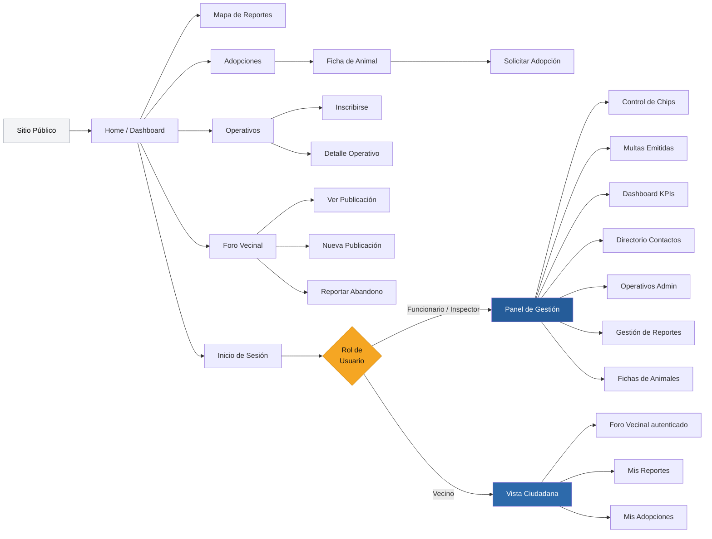
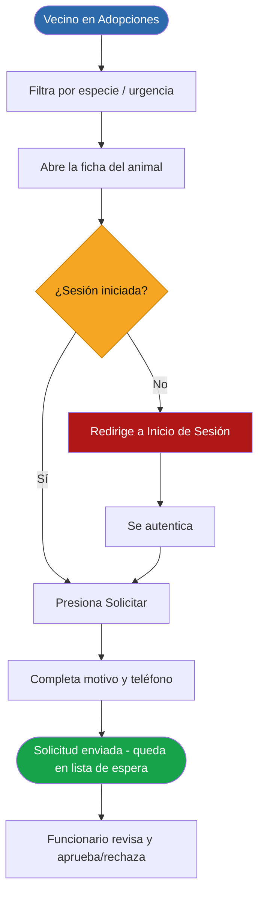

# App Bienestar Animal - Municipalidad de Santo Domingo

Esta aplicación es una plataforma desarrollada para la Municipalidad de Santo Domingo que busca fomentar la tenencia responsable de mascotas, permitiendo a los usuarios reportar incidentes, gestionar adopciones y visualizar un mapa de calor comunal en tiempo real.

**Prototipo interactivo en Figma:** [Ver Mockup Web](https://www.figma.com/site/3oyQIa6mumsEFA5U5rl4V9/Mockup-WEB?node-id=0-1&p=f&t=PePYONOImoEJhd8l-0) *(acceso público)*  
**Arquitectura UX en Figma:** [Ver Diagrama Completo](https://www.figma.com/board/cgeHwEwXP67bQdPYxucQKI/Arquitectura-UX---Bienestar-Animal?node-id=0-1&p=f&t=DJdrskBNUpx3DqUi-0) *(acceso público)*

---

## Tecnologías Utilizadas

| Capa | Tecnología |
|------|-----------|
| Framework UI | Ionic Framework + React 19 |
| Lenguaje | TypeScript |
| Build Tool | Vite 7 |
| Estilos | Tailwind CSS v4 |
| Enrutamiento | React Router v5 (vía `@ionic/react-router`) |
| Backend | Node.js + Express + TypeScript |
| Base de datos / ORM | PostgreSQL + Prisma |
| Autenticación | JWT (`jsonwebtoken`) + bcrypt |
| Pruebas de API | Postman |

## Requisitos e Instalación

### Requisitos previos

- **Node.js 18+** y npm.
- **PostgreSQL 14+** en ejecución (para el backend).
- *(Opcional)* CLI de Ionic: `npm install -g @ionic/cli`.

El proyecto tiene dos partes: el **backend** (`/backend`) y el **frontend** (raíz). Para
probar la aplicación completa con autenticación, levanta primero el backend.

### 1. Clonar el repositorio

```bash
git clone https://github.com/Dakotahh1/Pagina-Web-Municipalidad-Santo-Domingo.git
cd Pagina-Web-Municipalidad-Santo-Domingo
```

### 2. Backend (API REST + base de datos)

```bash
cd backend
npm install                 # instala dependencias
cp .env.example .env         # crea el archivo de entorno (ajusta DATABASE_URL y JWT_SECRET)
npx prisma migrate dev       # crea las tablas en PostgreSQL
npm run seed                 # carga roles, usuarios y datos de prueba
npm run dev                  # levanta la API en http://localhost:3001
```

### 3. Frontend (Ionic + React)

En **otra terminal**, desde la raíz del proyecto:

```bash
npm install                  # instalación limpia, sin flags adicionales
npm run dev                  # o `ionic serve` — abre http://localhost:5173 (8100 con Ionic CLI)
```

> El frontend lee la URL de la API desde `VITE_API_URL` (ver `.env.example`).
> Por defecto apunta a `http://localhost:3001/api`.

### Usuarios de prueba (cargados por el seed)

| Correo | Contraseña | Rol |
| :--- | :--- | :--- |
| `vecino@muni.cl` | `vecino123` | Vecino |
| `funcionario@muni.cl` | `func456#` | Funcionario |
| `inspector@muni.cl` | `insp789#` | Inspector |

---

## EP 1.2: Justificación del Problema y Usuario Objetivo

### Contexto y Necesidad Comunal

La comuna de Santo Domingo presenta una marcada dualidad geográfico-social, dividida en extensas áreas rurales y zonas urbanas densas. Esta distribución dificulta el control de la tenencia responsable de mascotas, traduciéndose en una constante proliferación de animales callejeros y denuncias por ataques a fauna nativa o ganadería menor.

Actualmente, el municipio gestiona estos problemas de manera informal (registros en papel y reportes aislados en WhatsApp), lo que causa:

1. Pérdida de la trazabilidad en brotes de enfermedades zoonóticas.

2. Imposibilidad de generar estadísticas consolidadas para justificar la inyección de presupuestos estatales.

3. Respuestas tardías ante emergencias ciudadanas debido a la falta de centralización de la información.

### Análisis del Usuario Objetivo

La plataforma atiende a dos perfiles claramente diferenciados. Para cada uno se identifican sus características, necesidades, dificultades y expectativas:

#### Perfil 1 — Vecino / Ciudadano

- **Características:** habitante de la comuna de Santo Domingo, de edad heterogénea (incluye adultos mayores), con alfabetización digital media-baja y acceso mayoritariamente desde el teléfono móvil, frecuentemente bajo conectividad 3G/4G inestable en zonas rurales.
- **Necesidades:** reportar de forma rápida y guiada animales abandonados o heridos, dar seguimiento al estado de sus reportes, postular a adopciones e inscribirse en operativos de vacunación/esterilización cercanos.
- **Dificultades:** hoy depende de canales informales (WhatsApp, llamadas, papel) sin trazabilidad ni respuesta clara; interfaces complejas o densas lo excluyen.
- **Expectativas:** un flujo simple "paso a paso", botones grandes y legibles, confirmación visible de cada acción y un número de caso para hacer seguimiento.

#### Perfil 2 — Funcionario / Inspector Municipal

- **Características:** personal de la Unidad de Bienestar Animal que trabaja principalmente desde un computador de escritorio en oficina, con alfabetización digital media-alta y necesidad de operar volúmenes de datos.
- **Necesidades:** centralizar reportes, gestionar fichas clínicas y microchips, programar operativos, emitir multas y visualizar indicadores (KPIs) para justificar presupuesto ante el Estado.
- **Dificultades:** la información dispersa impide consolidar estadísticas, perder trazabilidad de brotes zoonóticos y priorizar casos urgentes.
- **Expectativas:** un panel de gestión tipo escritorio (tablas, formularios técnicos y métricas) separado de la vista ciudadana, con accesos diferenciados según el nivel de privilegio (funcionario vs. inspector).

---

## EP 1.1: Requerimientos del Sistema

### Roles Definidos

- **Vecino:** Ciudadano de la comuna que consume información, genera reportes y solicita adopciones.
- **Funcionario / Inspector:** Personal municipal que gestiona casos, administra fichas, registra operativos y consulta estadísticas.

### Requerimientos Funcionales

| ID | Módulo | Descripción por rol | Métrica Cuantitativa de Evaluación |
|----|--------|---------------------|------------------------------------------- |
| **RF-01** | Foro de Reportes | El Vecino puede publicar incidentes adjuntando texto, coordenadas geográficas y fotos. El Funcionario puede cambiar el estado a "Resuelto".| Tiempo de persistencia en renderizado menor a 1.5s. Admisión de strings de texto de hasta 1000 caracteres  |
| **RF-02** | Gestión de Adopciones | El Vecino visualiza animales y presiona "Solicitar". El Funcionario recibe la solicitud en una lista de espera indexada.| El sistema debe soportar un mínimo de 200 solicitudes simultáneas sin pérdida de paquetes de datos. |
| **RF-03** | Ficha Clínica Digital | El Funcionario puede crear, actualizar y archivar el historial médico de un animal (vacunas, esterilizaciones).| El formulario debe validar campos obligatorios y rechazar inputs nulos con alertas nativas en < 200ms. |
| **RF-04** | Gestión de Operativos | El Funcionario agenda operativos territoriales. El Vecino se inscribe reduciendo los cupos disponibles en tiempo real. | Decremento atómico del contador de cupos. Bloqueo automático del botón de inscripción al llegar a 0 cupos. |
| **RF-05** | Control de Microchips | El Inspector asocia un código de microchip único al RUT de un vecino mediante un formulario indexado. | Validación de expresión regular: El código de chip debe poseer exactamente 15 dígitos numéricos estándar. |
| **RF-06** | Directorio de Contactos | Ambos Roles pueden consultar teléfonos, correos y horarios de la unidad de protección animal. | Buscador reactivo indexado por caracteres que filtra los datos en pantalla en un tiempo máximo de 100ms. |
| **RF-07** | Dashboard Estadístico | El Funcionario visualiza gráficos dinámicos con los KPIs mensuales del estado de la tenencia comunal.| Precisión del 100% en el cálculo de métricas en base a las filas de la consulta relacional SQL ejecutada. |

### Requerimientos No Funcionales (Medibles)

**RNF-01 (Usabilidad / Accesibilidad):** La interfaz debe garantizar una tasa de contraste mínima de 4.5:1 para textos normales conforme a las pautas WCAG 2.1 AA, utilizando botones interactivos expansivos (mínimo 48px de área táctil) para facilitar el uso a adultos mayores en Santo Domingo.

**RNF-02 (Rendimiento en Entornos Rurales):** El tamaño de carga de la landing page principal no debe exceder los 2.5 MB. Las imágenes de incidentes deben ser comprimidas en el cliente a un máximo de 2MB antes de viajar por la red, permitiendo un funcionamiento fluido en zonas con conectividad 3G/4G inestable.

**RNF-03 (Seguridad / Control de Acceso):** Todas las solicitudes a rutas administrativas (/admin/*) deben estar validadas mediante un middleware interceptor de tokens JWT. Cualquier petición sin credenciales o con un rol no autorizado debe ser rechazada y redirigida al /login en menos de 50ms.

---

## EP 1.3: Bocetos UI/UX y Mockups

A continuación se presentan los wireframes de media fidelidad desarrollados. Para cumplir la directriz de diseño centrado en el usuario, se han destacado los componentes interactivos (sidebars y menús) mediante bordes definidos y botones contrastados, asegurando que el evaluador distinga claramente los elementos clicables de los estructurales.

**Pagina de inicio**


**Panel administrativo**


**Ficha Animal**


---

## EP 1.4: Arquitectura de Navegación y UX

### Diagrama General de Arquitectura UX

<!-- INSTRUCCIÓN: subir Arquitectura_UX_-_Bienestar_Animal.png a un Issue de GitHub,
     copiar el link generado y reemplazar la línea de abajo -->
>  Ver diagrama completo en Figma: [Arquitectura UX — Bienestar Animal](https://www.figma.com/board/cgeHwEwXP67bQdPYxucQKI/Arquitectura-UX---Bienestar-Animal?node-id=0-1&p=f&t=DJdrskBNUpx3DqUi-0)

### Rutas del Sistema

| Zona | Rutas Disponibles |
|------|------------------|
| **Pública** (sin sesión) | `/login` · `/registro` |
| **Ciudadana** (Vecino autenticado) | `/app/inicio` · `/app/adopciones` · `/app/adopciones/:id` · `/app/foro` · `/app/operativos` · `/app/reportar` · `/app/mapa` |
| **Administrativa** (Funcionario) | `/admin/dashboard` · `/admin/reportes` · `/admin/fichas` · `/admin/chips` · `/admin/multas` |

### Mapa de Navegación y Jerarquía de Vistas

La vista **Inicio** funciona como concentrador principal (Nivel 1). Las vistas funcionales como Adopciones o Foro corresponden al **Nivel 2**. Las vistas de detalle como la Ficha de un animal son de **Nivel 3** y siempre exigen retorno directo a su vista padre.



### Permisos por Rol

| Acción | Público | Vecino | Funcionario | Inspector |
|--------|:-------:|:------:|:-----------:|:---------:|
| Ver adopciones | ✅ | ✅ | ✅ | ✅ |
| Ver Home / Dashboard | ✅ | ✅ | ✅ | ✅ |
| Ver mapa de reportes | ✅ | ✅ | ✅ | ✅ |
| Ver operativos | ✅ | ✅ | ✅ | ✅ |
| Leer foro | ✅ | ✅ | ✅ | ✅ |
| Solicitar adopción | ❌ | ✅ | ✅ | ✅ |
| Reportar incidente | ❌ | ✅ | ✅ | ✅ |
| Mis reportes y seguimiento | ❌ | ✅ | ✅ | ✅ |
| Publicar en foro | ❌ | ✅ | ✅ | ✅ |
| Dar animal en adopción | ❌ | ✅ | ✅ | ✅ |
| Dashboard con KPIs | ❌ | ❌ | ✅ | ✅ |
| Crear y editar fichas | ❌ | ❌ | ✅ | ✅ |
| Gestionar reportes | ❌ | ❌ | ✅ | ✅ |
| Directorio de contactos | ❌ | ❌ | ✅ | ✅ |
| Registrar operativos | ❌ | ❌ | ✅ | ✅ |
| Publicaciones oficiales | ❌ | ❌ | ✅ | ✅ |
| Fotografías y evidencia | ❌ | ❌ | ❌ | ✅ |
| Registrar chips | ❌ | ❌ | ❌ | ✅ |
| Emitir multas | ❌ | ❌ | ❌ | ✅ |
| Delegar y asignar casos | ❌ | ❌ | ❌ | ✅ |

### Flujo de Tarea Principal — Reportar un Incidente

El reporte ciudadano es el flujo más crítico del sistema. Está diseñado como un asistente paso a paso para reducir la fricción, especialmente cuando el usuario enfrenta una situación urgente.


### Flujo de Tarea Secundaria — Solicitar una Adopción

Segundo flujo crítico del rol Vecino. Convierte la exploración del catálogo en una solicitud trazable para el funcionario.



### Puntos Críticos de Interacción

Se identifican los momentos donde el usuario puede abandonar la tarea o cometer errores, y la mitigación adoptada:

| Punto crítico | Riesgo | Mitigación de diseño |
|---|---|---|
| Reporte de incidente urgente | Fricción/abandono ante una emergencia | Asistente paso a paso con un solo objetivo por pantalla |
| Acción que exige sesión (reportar, adoptar) | Pérdida del contexto al redirigir al login | Redirección con retorno al flujo original tras autenticarse |
| Inscripción a operativo con cupos | Inscribirse en un evento ya lleno | Decremento atómico de cupos y bloqueo del botón al llegar a 0 |
| Envío de formularios (registro, ficha) | Datos inválidos o incompletos | Validaciones visuales en cliente + validación en backend |
| Cambio de zona ciudadana ↔ panel admin | Acceso a vistas sin privilegios | Guardas de ruta (`ProtectedRoute`) que redirigen según el rol |

### Coherencia de Experiencia entre Dispositivos

La arquitectura mantiene el mismo modelo mental en móvil y escritorio, adaptando solo el patrón de navegación al contexto de uso:

| Aspecto | Móvil (Vecino) | Escritorio (Funcionario / Inspector) |
|---|---|---|
| Navegación principal | Barra inferior (`IonTabs`) para uso con una mano | Sidebar lateral fijo (`IonMenu`) que aprovecha el ancho |
| Densidad de información | Tarjetas apiladas en una columna | Tablas y KPIs en grilla multicolumna |
| Acciones primarias | Botones expansivos de alto contraste | Botones y filas de tabla con estados *hover* |
| Continuidad | Mismas rutas, etiquetas e iconografía en ambos formatos, de modo que la curva de aprendizaje se traslada entre dispositivos |

### Decisiones de Diseño Justificadas

**Navegación Fija mediante Sidebar en Computadores:** Para el rol Funcionario se optó por un menú lateral izquierdo permanente. Esto aprovecha el ancho panorámico de los monitores de oficina de la municipalidad, manteniendo visibles los accesos directos y reduciendo el número de clics necesarios para alternar entre la gestión de fichas clínicas y la emisión de multas.
- **Separación visual total entre zona ciudadana y panel administrativo:** Los funcionarios requieren flujos de trabajo distintos (tablas, KPIs, formularios técnicos) que no son apropiados para el vecino.
- **Diseño responsivo diferenciado:** En escritorio (Funcionario) se emplea un Sidebar para aprovechar el ancho de pantalla. En móvil (Vecino) la navegación usa Bottom Tabs para acceso con una sola mano.
- **Framework Arquitectónico (Ionic + React):** La selección técnica responde directamente a la necesidad de construir una Single Page Application (SPA) altamente escalable. Al compilar sobre componentes nativos web optimizados, eliminamos la necesidad de descargas pesadas desde tiendas de aplicaciones, permitiendo a los ciudadanos rurales acceder instantáneamente escaneando códigos QR distribuidos en las juntas de vecinos de la comuna.

### Referencias de Diseño

Las decisiones anteriores se sustentan en principios reconocidos de usabilidad y accesibilidad:

- **Heurísticas de Nielsen:** "visibilidad del estado del sistema" (confirmaciones y número de caso en cada acción) y "prevención de errores" (validaciones y bloqueo de acciones inválidas).
- **WCAG 2.1 AA:** contraste mínimo 4.5:1 y áreas táctiles ≥ 48px, justificando los botones expansivos para adultos mayores (ver RNF-01).
- **Mobile-first y diseño adaptativo de Ionic:** patrones de navegación distintos por dispositivo (`IonTabs` en móvil, `IonMenu` en escritorio) siguiendo la documentación oficial de Ionic Framework.
- **Ley de Fitts:** objetivos de interacción grandes y bien separados reducen el tiempo y el error al apuntar, especialmente en pantallas táctiles.

---

## EP 1.5 y EP 1.6: Arquitectura de Código e Integración del Enrutador

La aplicación implementa una arquitectura modular estricta y desacoplada bajo TypeScript, separando las responsabilidades de las vistas, los componentes de diseño atómicos, la lógica de estados globales y la comunicación asíncrona con el backend.

### Estructura y Árbol de Directorios del Proyecto
A continuación, se documenta la disposición real del código fuente dentro del directorio `src/`, reflejando una organización limpia alineada con las mejores prácticas de desarrollo en React e Ionic Framework:

```text
src/
├── components/             # Componentes visuales reutilizables
│   ├── AuthLayout.tsx      # Contenedor de las pantallas de autenticación
│   ├── AuthHeroPanel.tsx   # Panel lateral con estadísticas (login/registro)
│   ├── AuthFooter.tsx      # Pie de página de los formularios de credenciales
│   ├── FormField.tsx       # Campo de formulario con etiqueta y validación visual
│   ├── PasswordInput.tsx   # Input de contraseña con máscara y botón mostrar/ocultar
│   ├── NavBar.tsx          # Barra de navegación superior de las vistas del vecino
│   ├── RevealWrapper.tsx   # Animación de aparición progresiva al hacer scroll
│   ├── SupportNote.tsx     # Nota de soporte/accesibilidad al pie de los flujos
│   ├── styles.ts           # Estilos compartidos de los formularios
│   └── index.ts            # Barrel export de componentes
├── context/                # Estado global de la aplicación
│   ├── AuthContext.tsx     # Proveedor de sesión JWT (token + rol, persistencia)
│   └── useAuth.ts          # Hook de acceso al contexto de autenticación
├── pages/                  # Vistas, segregadas por nivel de acceso
│   ├── private/            # Rutas protegidas (requieren sesión)
│   │   ├── MainTabs.tsx        # Contenedor IonTabs de la zona ciudadana (vecino)
│   │   ├── Inicio.tsx          # Portada autenticada del vecino
│   │   ├── adopciones.tsx      # Catálogo de adopciones (consume GET /api/animales)
│   │   ├── FichaAnimal.tsx     # Detalle de un animal
│   │   ├── foro.tsx            # Foro vecinal
│   │   ├── operativos.tsx      # Operativos territoriales
│   │   ├── ReportarIncidente.tsx # Asistente de reporte ciudadano
│   │   ├── MapaReportes.tsx    # Mapa de calor de reportes
│   │   ├── Directorio.tsx      # Directorio de contactos
│   │   └── InspectorDashboard.tsx # Panel de gestión (funcionario / inspector)
│   └── public/             # Rutas públicas (sin sesión)
│       ├── Login.tsx       # Inicio de sesión (vecino y personal municipal)
│       └── Registro.tsx    # Registro de vecinos
├── routes/                 # Control de acceso por rol
│   └── ProtectedRoute.tsx  # Guardián de rutas: valida sesión y rol (integrado en App.tsx)
├── services/               # Capa de consumo de la API REST (EP 2.4)
│   ├── api.ts              # Cliente HTTP con interceptores y gestión de token JWT
│   ├── authService.ts      # Endpoints de autenticación (login, admin-login, register)
│   ├── animalesService.ts  # Endpoints de animales (GET /api/animales)
│   └── index.ts            # Barrel export de servicios
├── theme/
│   └── variables.css       # Variables CSS institucionales + import de Tailwind
├── App.tsx                 # Enrutamiento de la SPA (rutas públicas y protegidas)
├── main.tsx                # Punto de entrada (monta React en el DOM)
└── vite-env.d.ts           # Tipos del entorno de Vite
```

> **Integración del enrutador (corrección EP 1.6):** `ProtectedRoute` se consume
> directamente desde `App.tsx`, envolviendo las rutas `/app/*` (vecino) y
> `/admin/dashboard` (funcionario/inspector), de modo que la capa de rutas queda
> efectivamente integrada y no como un archivo aislado.

---

# Entrega Parcial 2: Integración Frontend + Backend y Autenticación

## EP 2.1 y EP 2.2: Entorno del Servidor y Modelado del Sistema Relacional

El ecosistema de backend está desarrollado de forma desacoplada sobre **Node.js utilizando Express con TypeScript** , empleando **Prisma ORM** como motor de mapeo objeto-relacional para la persistencia e integridad de los datos en **PostgreSQL**.

### Datos de Inicialización y Pruebas (Script Seed de Base de Datos)
El sistema cuenta con un script automatizado de poblamiento (`prisma/seed.ts`) que inicializa los roles, las mascotas, los reportes en el mapa de calor, los operativos y las publicaciones del foro. Los usuarios de prueba cargados en la base de datos `bienestar_animal` son:

| Nombre del Usuario | Correo Electrónico | Contraseña de Acceso | Rol Asignado | RUT Obligatorio |
| :--- | :--- | :--- | :--- | :--- |
| María González | `vecino@muni.cl` | `vecino123` | `vecino` | `12.345.678-9` |
| Carlos Muñoz | `funcionario@muni.cl` | `func456#` | `funcionario` | *Interno Municipal* |
| Inspector Rodríguez | `inspector@muni.cl` | `insp789#` | `inspector` | *Interno Municipal* |

### Diagrama del Modelo Relacional (Integridad Referencial)
Para dar estricto cumplimiento al respaldo del diseño de datos, se adjunta el esquema relacional que asegura que no queden registros huérfanos gracias a directrices de integridad como `ON DELETE CASCADE`:


---

## EP 2.3 y EP 2.4: API REST y Consumo de Servicios en Escritorio

El backend levanta de forma local en el puerto `3001` (`http://localhost:3001/api`), interactuando con el frontend mediante peticiones asíncronas optimizadas y controladas con Axios/Fetch. Las respuestas emplean de manera estricta códigos de estado HTTP estandarizados y estructuras JSON uniformes:

| Método | Endpoint Base | Descripción del Servicio (Foco Web) | Nivel de Acceso Obligatorio | Código OK | Código Error |
| :---: | :--- | :--- | :--- | :---: | :---: |
| **POST** | `/api/auth/admin-login` | Autenticación y firma de token para personal administrativo. | Público | `200 OK` | `401 / 403` |
| **GET** | `/api/auth/me` | Recupera el perfil del usuario dueño del token en sesión. | Token Requerido | `200 OK` | `401 Unauthorized` |
| **GET** | `/api/auth/inspector/chips`| Módulo restringido para el control y registro de microchips. | Solo `inspector` | `200 OK` | `403 Forbidden` |
| **GET** | `/api/animales` | Obtiene el listado completo de mascotas desde PostgreSQL. | Público | `200 OK` | `500 Server Error` |

### Métrica de Estructura JSON de Respuesta (`GET /api/animales`)
```json
{
  "success": true,
  "data": [
    {
      "id": 3,
      "nombre": "Leonidas",
      "especie": "Perro",
      "raza": "Mestizo",
      "sexo": "Macho",
      "edad": 3,
      "color": "Negro",
      "vacunado": true,
      "castrado": true,
      "chip": "LEO-7777-2222-44444",
      "descripcion": "Perro leal y protector",
      "estado_adopcion": "En tratamiento"
    }
  ]
}
```

## EP 2.5 y EP 2.6: Seguridad de la API, Autenticación y Control Anti-Inyección

Para blindar la plataforma municipal contra vulnerabilidades y accesos indebidos, se implementaron cuatro pilares de seguridad informática activa:

**Protección Crítica contra Inyecciones SQL:** Para subsanar las ambigüedades de código, el servidor procesa las consultas mediante el motor de Prisma ORM empleando consultas SQL parametrizadas de forma posicional ($1, $2, $3). Esto previene que una inserción maliciosa altere la lógica relacional del compilador, tal como se evidencia en los logs reales del servidor: 
```
SELECT "public"."Usuario"."id", "public"."Usuario"."correo"... FROM "public"."Usuario" WHERE ("public"."Usuario"."correo" = $1 AND 1=1) LIMIT $2 OFFSET $3
```

**Cifrado Criptográfico con bcrypt:** Las contraseñas de los ciudadanos y funcionarios jamás se almacenan ni viajan en texto plano en la base de datos relacional. Al registrar o inicializar un usuario, se genera un Hash irreversible utilizando la librería bcrypt con un factor de seguridad de 10 salt rounds. 

**Autenticación Basada en Tokens JWT:** Tras la validación correcta de credenciales por bcrypt.compare(), el servidor expide un JSON Web Token firmado bajo la firma algorítmica HS256, configurado con una expiración rígida de 8 horas para mitigar secuestros de sesión. 

**Middleware de Validación de Roles (Control Perimetral):** El backend cuenta con interceptores lógicos (verifyJWT y requireRole). Si un encabezado Authorization tipo Bearer Token llega alterado, malformado o ausente, la petición es rechazada ipso facto con un código 401 Unauthorized. Si el token posee un rol con privilegios insuficientes, se deniega el acceso con un código _403 Forbidden_.

---

## EP 2.7: Pruebas Funcionales y Evidencias Técnicas en Postman

Cada endpoint y middleware de control de accesos fue sometido a pruebas funcionales en Postman con el servidor ejecutándose en desarrollo (http://localhost:3001), capturando las respuestas controladas del sistema: 

**Prueba 1: Login de Personal Administrativo Exitoso** **(POST _/api/auth/admin-login_)**

**Estado HTTP:** 200 OK   
**Sustento Técnico:** Envío de credenciales correctas de un funcionario. El servidor responde con success: true, los metadatos del usuario y el token JWT de autorización generado.


**Prueba 2: Acceso a Perfil con Token de Autorización Válido (GET _/api/auth/me_)**
**Estado HTTP:** 200 OK   
**Sustento Técnico:** Envío del JWT válido en la cabecera Authorization: Bearer <token>. El middleware verifica la firma y retorna los datos comunales e institucionales del usuario (Valparaíso, Santo Domingo).  


**Prueba 3: Bloqueo de Ruta Segura por Token Ausente (GET _/api/auth/me_)**
**Estado HTTP:** 401 Unauthorized   
**Sustento Técnico:** Intento de consulta perimetral sin cabeceras de autenticación. El middleware frena la ejecución antes de tocar el controlador y despacha el código de error controlado TOKEN_MISSING.  


**Prueba 4: Rechazo por Token Inválido o Modificado (GET _/api/auth/me_)**
**Estado HTTP:** 401 Unauthorized   
**Sustento Técnico:** Envío de una firma malformada de prueba (tokenbasura123). El método jwt.verify() arroja una excepción controlada respondiendo con el código de error TOKEN_INVALID. 


**Prueba 5: Denegación de Acceso por Nivel de Rol Insuficiente (GET _/api/auth/inspector/chips_)**
**Estado HTTP:** 403 Forbidden   
**Sustento Técnico:** Simulación de intrusión donde un usuario con el rol de funcionario intenta consumir un recurso exclusivo del rol de inspector. El token es estructuralmente íntegro (pasa el filtro 401), pero la validación lógica del interceptor rechaza la acción con el código de error


**Prueba 6: Consulta de Registros de Mascotas desde PostgreSQL (GET _/api/animales_)**
**Estado HTTP**: 200 OK   
**Sustento Técnico: **Endpoint público que realiza de forma directa la consulta a la tabla Mascota de PostgreSQL mediante Prisma ORM, trayendo los datos serializados en un arreglo de objetos del inventario real de la municipalidad. 


---

## Equipo de Desarrollo

| Nombre | Rol |
|--------|-----|
| Vicente Palma | Desarrollador Frontend y Backend, Documentación |
| Diego Alvarado | Aquitectura y Diseño UI/UX, Desarrollador Frontend |
| Ignacia Brahim | Documentación, Desarrolladora Backend, Aquitectura y Diseño UI/UX  |

---

*Documento elaborado a partir de entrevista con el Jefe de Informática de la Municipalidad de Santo Domingo.*  
*Curso ICI4247-2 — Pontificia Universidad Católica de Valparaíso, 2026.*
